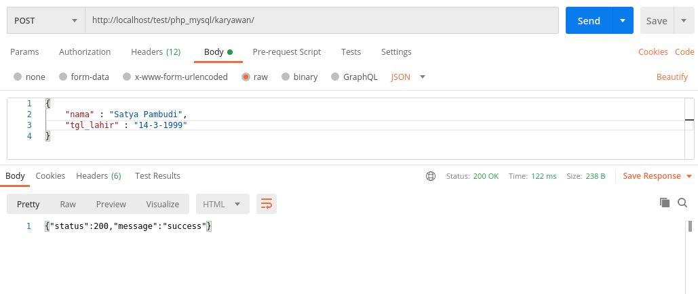
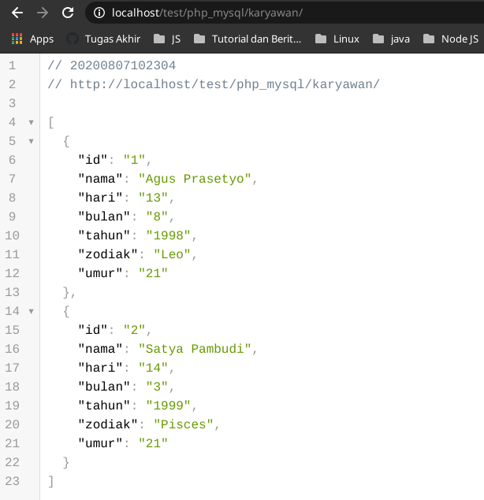

# PHP & MySQL Test

## POST

Sistem berhasil menambahkan data pada tabel `karyawan` dengan menggunakan `body response (JSON)` dengan parameter `nama` dan `tgl_lahir` sesuai dengan soal yang terlampir pada [[ SOAL ]](https://github.com/gdevilbat/Ujian_Backend_Ajita_05#soal-3---php--mysql)

Data berhasil di disimpan pada tabel `karyawan`

## GET

Sistem berhasil menampilkan data `karyawan` yang sudah ditambahkan melalui `body request` sesuai dengan soal yang terlampir pada [[ SOAL ]](https://github.com/gdevilbat/Ujian_Backend_Ajita_05#soal-3---php--mysql)

## Route

[ GET ] : `localhost/test/php_mysql/karyawan/`

 

[ POST ] : `localhost/test/php_mysql/karyawan/`